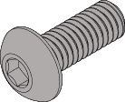
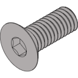
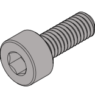
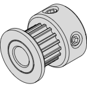
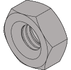
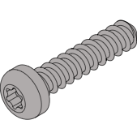
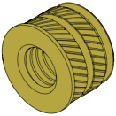

### HARDWARE 

|  |  |  |  | 
| --- | --- | --- | --- |
| **BUTTON HEAD CAP SCREW (BHCS)** | **FLAT HEAD CAP SCREW (FHCS)** | **SOCKET HEAD CAP SCREW (SHCS)** | **GRUB SCREW (GS)** |
| Metric fastener with a domed shaped head and hex drive. Most commonly found in locations where M3 fasteners are used. | Metric fastener with a cone shaped head and a flat top. | Metric fastener with a cylindrical head and hex drive. The most common fastener used on the Voron. | Metric Socket Cup Point Set Screws (also called Hollow Point Grub Screws) are fitted with a concave cup point, which allows them to fit closely against a rounded surface such as a motor shaft |
| ISO 7380-1 | ISO 10642 | ISO 4762 / DIN 912 | ISO 4029/ DIN 916 |

|  |  |  |  | 
| --- | --- | --- | --- |
| **PULLEY** | **HEX NUT** | **SELF TAPPING SCREW** | **HEAT SET INSERT** |
| GT2 pulley used on the motion system of the Micron. | Hex nuts couple with bolts to create a tight, secure joint. You’ll see these used in both M2 and M3 variants throughout this guide. | Fastener with a pronounced thread profile that is screwed directly into plastic. | Heat the inserts with a soldering iron so that they melt the plastic when installed. As the plastic cools, it solidifies around the knurls and ridges on the insert for excellent resistance to both torque and pull-out. |
|  | ISO 4032 / DIN 934 | ISO 4762 / DIN 912 |  |
